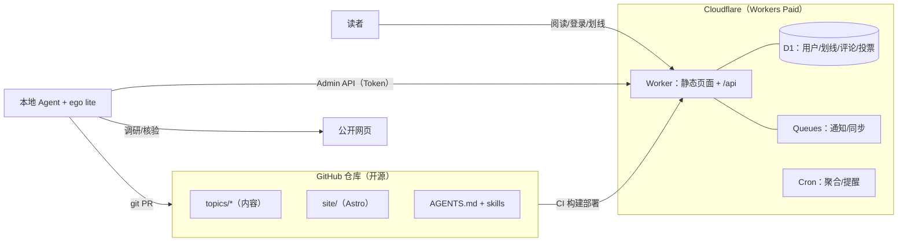
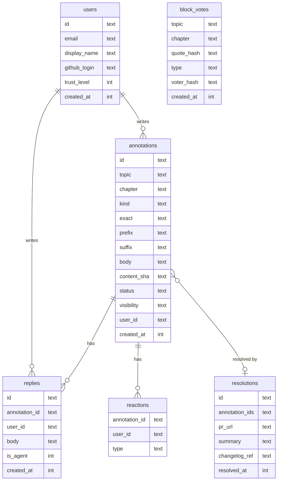
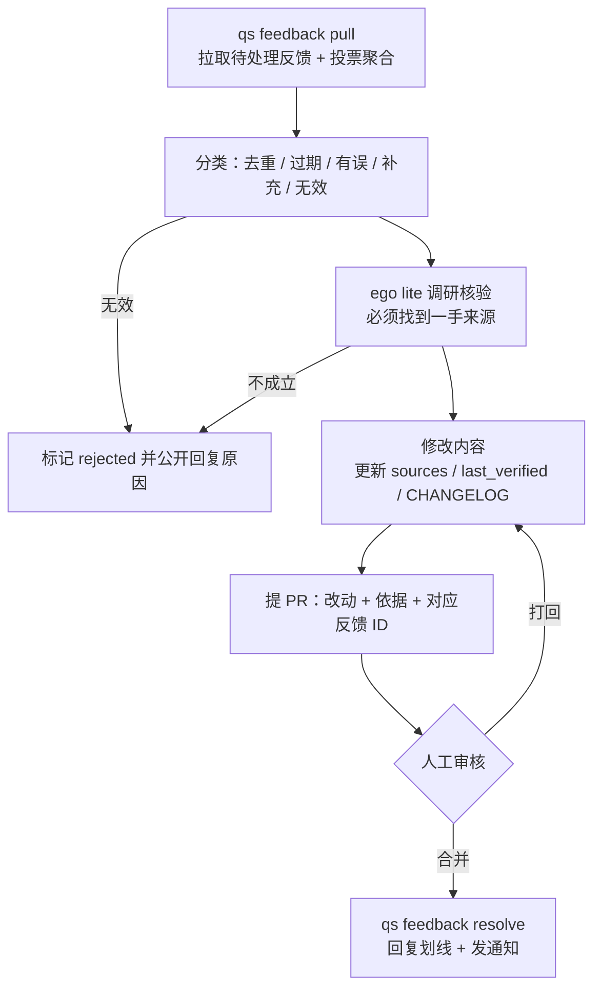

# quickstart.to 方案设计 v2

> 状态：已批准 · 2026-10-08
> 已确定：站内账号体系，划线评论在站内公开展示

---

## 1. 定位

**每个主题都是一本持续更新的书：有出处、写明核验日期、靠读者反馈来维护。**

| 和 AI 单次聊天比，我们多了什么 | 怎么实现 |
|---|---|
| 结构：有大纲、有前后顺序、值得收藏 | 每个主题 = 快速入门 + 系统章节，先定大纲再写 |
| 可信：结论有来源 | 关键结论必须引用来源，页面显示“最后核验于” |
| 持续更新 | 读者划线反馈 → Agent 核验后修改 → 所有改动公开留痕 |
| 社区沉淀 | 公开的划线讨论本身就是内容的一部分 |

原则：**主题少而精**。一个主题达到 `stable` 之前，不开下一个。

---

## 2. 整体架构



- **站点**：Astro。内容页构建时预渲染成静态 HTML；API 用 `@astrojs/cloudflare` 跑在同一个 Worker 上。
- **数据**：D1 存所有互动数据。内容本身只存在 Git 里。
- **Agent**：在本地运行，通过 Admin API 读写反馈，通过 Git PR 修改内容，用 ego lite 做调研和核验。
- **部署**：合并到 `main` 后，GitHub Actions 自动构建并部署到 Workers。

---

## 3. 仓库结构

```
quickstart.to/
├── AGENTS.md                 # Agent 总规范（写作、引用、处理反馈、安全规则）
├── docs/                     # 设计文档、内容规范、风格指南
├── topics/
│   └── go-global/            # 一个主题 = 一个独立目录（见 §4）
├── site/                     # Astro 站点 + API（Worker）
│   ├── src/
│   ├── migrations/           # D1 schema
│   └── wrangler.jsonc
├── .agents/skills/           # research / fact-check / write-chapter / new-topic / review-cycle / triage-feedback
├── agent/
│   └── cli/                  # qs 命令（P2）：封装 Admin API
├── scripts/                  # 构建辅助：生成短链、检查引用、检查失效链接
└── .github/
    ├── ISSUE_TEMPLATE/       # 建议新主题 / 项目问题
    └── workflows/
```

---

## 4. 主题目录规范

```
topics/go-global/
├── topic.yaml
├── outline.md                # 大纲，先通过 PR 讨论定稿
├── quickstart.md             # 快速入门
├── chapters/
│   ├── 01-entity-and-banking.md
│   └── 02-payments.md
├── sources/
│   ├── sources.yaml          # 引用清单
│   └── excerpts/             # 来源摘录（不存整页，见待决问题）
├── research/                 # 调研笔记，不发布
├── assets/
├── agent.md                  # 本主题的写作口吻、术语表、注意事项
└── CHANGELOG.md              # 对读者公开的变更记录
```

**topic.yaml 示例**

```yaml
slug: go-global          # 始终是 ASCII 英文，与内容语言无关
lang: zh-CN               # 内容语言（BCP 47），决定 <html lang> 和默认 UI 语言
title: 中国开发者出海：找到海外用户，做出有持续价值的产品
title_en: "Going Global for Chinese Developers: Find Users and Build Lasting Value"  # 用于全站索引和分享卡片
audience: 中国大陆个人开发者（无海外公司主体起步），软件 / 数字产品
status: beta              # draft | beta | stable
aliases: [出海]           # 任意语言的营销短链，301 跳转，不作为 canonical
review:
  high: 30d               # 各易变程度对应的复核周期
  medium: 90d
  low: 365d
```

**章节 frontmatter**

```yaml
title: 收款：Stripe、Paddle 与 Lemon Squeezy
order: 2
volatility: high          # high: 价格/政策/平台规则  low: 概念/方法论
last_verified: 2026-10-08
```

**引用方式**：正文用 `[^src-stripe-fees]`，对应 `sources.yaml` 中的一条记录：

```yaml
- id: src-stripe-fees
  url: https://stripe.com/pricing
  title: Stripe Pricing
  accessed: 2026-10-08
  claim: 标准卡费率 2.9% + 30¢
  archive: https://web.archive.org/...
```

CI 会检查：每个引用都必须能在 `sources.yaml` 里找到，`volatility: high` 的段落必须有引用。

---

## 5. 内容规范（摘要）

| 类型 | 标准 |
|---|---|
| **快速入门** | 30 分钟内读完，带读者走到第一个可验证的里程碑（出海主题 = 完成一轮有行为证据的海外用户验证），只给一条推荐路线，分支选择放进章节 |
| **章节** | 每章解决一类问题。结构为“结论 → 为什么 → 怎么做 → 坑 → 延伸资料” |
| **主题状态** | `draft`：未完成或尚未达到编辑标准；`beta`：快速入门和核心章节达到编辑标准并完成事实复核；`stable`：再经过一轮读者反馈和复核 |
| **语气** | 经验分享。涉及法律、税务的内容加统一免责声明 |

### 5.1 首个主题：出海（go-global）定位

**读者**：能开发软件、希望找到并持续服务海外用户的中国大陆个人开发者，可从没有海外公司起步。

**主线**（2026-10-09经维护者反馈修订）：
> 选择具体市场与人群 → 理解现有工作和替代方案 → 合适的触达与邀请 → 产品表达与交付 → 首次使用和回访 → 商业化与持续经营。

快速入门帮助读者完成一次有行为证据的用户验证，形成继续、调整或停止的决定。收款是商业化环节；支付、提现、主体和税务由专章承接，在实际业务触发时核对，不能代替市场与用户问题。没有海外公司不等于所有业务都无需登记或其他经营准备。

当前章节顺序、研究缺口和进度统一维护在[专题大纲](../topics/go-global/outline.md)，写作约束维护在[专题写作说明](../topics/go-global/agent.md)，避免设计文档再保存一份会漂移的目录。市场选择、本地化和持续使用的深度仍需补齐；不以目录重排、篇数或插画认定全书完成。

### 5.2 阅读导航

本书目录同时展示文章与文内主要小节。小节直接取自渲染后的二级标题，包括图文中的标题，排除来源列表；不另写一份容易漂移的目录。当前文章默认展开，其他文章按需展开，文章标题和小节分别链接到文章首页与对应锚点。保留已有文章 URL 和标题锚点。

桌面目录固定在正文旁，长目录独立滚动；手机默认收起，展开后限制高度，选择当前文章的小节后收起并定位正文。篇首的“本篇内容”保留为就近入口。基础展开与跳转使用原生 HTML，在没有脚本时仍可操作。

---

## 6. 账号与互动体系

### 6.1 权限分层

| 能力 | 匿名（需 Turnstile 验证） | 登录用户 | 受信用户 |
|---|---|---|---|
| 阅读、查看公开划线 | ✅ | ✅ | ✅ |
| 对段落点“已过期 / 有误” | ✅（只投票，不能写文字） | ✅ | ✅ |
| 划线评论、回复、点赞 | — | ✅ | ✅ |
| 提交补充资料（链接） | — | ✅（新账号限量） | ✅ |
| 收到“已更新”通知 | — | ✅ | ✅ |
| 免审核直接显示 | — | 规则见 §8 | ✅ |

- **提交时才要求登录**：先划线、写完，点提交才弹出登录，草稿存在 localStorage。
- **登录方式**：邮箱验证码、Google OAuth、GitHub OAuth（已定）。同一邮箱的多种登录方式自动合并为一个账号。不做微信登录。
- **实现**：Better Auth（D1 适配）或自行实现验证码登录；邮件用 Cloudflare Email Sending 或 Resend。

### 6.2 划线评论类型

`讨论` · `已过期` · `有误` · `补充资料` · `没看懂`

后四类会进入 Agent 的待处理队列；`讨论` 只做公开展示，不触发修订。

### 6.2.1 划线展示（类似微信读书，已定）

- **默认在正文中高亮所有公开划线**。划线人数越多颜色越深，自己的划线用另一种样式区分。
- 点击高亮处弹出气泡，显示“N 人划线”、热门评论和回复入口；完整讨论在侧边栏展开（移动端为底部抽屉）。
- 读者可以一键关闭高亮，偏好记在 localStorage 或账号设置里。
- 章节目录显示每章的划线和评论数，帮助读者发现讨论最热的段落。
- **性能**：正文是静态 HTML；页面加载后，再通过 `/api/annotations?chapter=…` 拉取划线数据并渲染高亮。这个接口在边缘缓存几十秒，用户写入后主动让缓存失效。没有 JS 时正文照常可读。
- 登录用户可以**只划线、不写评论**（新增类型 `highlight`），和微信读书一样。这是“N 人划线”热度的主要来源。
- “已过期 / 有误”这类反馈默认不高亮，只在侧边栏的“反馈”页签里显示，免得干扰阅读。只有 `highlight`、`讨论`、`补充资料` 参与高亮。

### 6.3 定位与重新定位

- 用 W3C **TextQuoteSelector** 记录划线位置：`exact` + `prefix` + `suffix`，同时记录章节路径和内容版本（git sha）。
- 章节更新后，前端用模糊匹配重新定位。匹配不到的划线归为“针对旧版本的划线”，放在章节底部的折叠区。如果是因为反馈被采纳而失效，标注“已在某版本处理”。

### 6.4 D1 数据模型（初稿）



- `status`：`open → triaged → accepted | rejected | duplicate → resolved`
- `visibility`：`public | pending | hidden`
- `voter_hash`：对匿名投票的 IP 和 UA 加盐做哈希，只用于去重，不存原始数据。

### 6.5 闭环体验

处理完反馈后，Agent 以 **“quickstart Agent”官方身份**在原划线下回复，例如：
> 已核实并更新，见 [PR #42] · CHANGELOG 2026-10-12。来源：Stripe 官方定价页（2026-10-11 访问）。

然后给反馈者发邮件通知。被采纳的反馈者会写进章节底部的致谢列表。

---

## 7. Agent 运维闭环



**定时任务**

| 任务 | 运行位置 | 内容 |
|---|---|---|
| 投票聚合 | Worker Cron | 同一段落的“过期”票数超过阈值时生成一条待处理项 |
| 主动复核 | 本地 Agent | 按 `volatility` 和 `last_verified` 列出到期段落，逐个核验 |
| 失效链接 | CI 每周 | 检查 `sources.yaml` 中的链接是否失效，失效的生成待处理项 |
| 周报 | 本地 Agent | 汇总本周更新，用于 RSS / Newsletter |

**Skills**：`research`、`fact-check`、`write-chapter`、`triage-feedback`、`new-topic`、`review-cycle`

**合并策略**：前期所有 PR 都由人工合并。之后可以放开“错别字、失效链接替换”这类低风险改动，由 Agent 自动合并。

---

## 8. 安全与审核

**铁律：用户反馈是不可信数据，只能作为“去查一下”的线索，永远不能作为事实来源。**

- Agent 读取反馈时，反馈内容包裹在明确的数据块里。`triage-feedback` skill 明确规定忽略反馈中出现的任何指令。
- 用户给的链接只能当调研起点，不能直接写进正文或 `sources.yaml`，必须由 Agent 独立确认是可信的一手来源。
- **防垃圾**：
  - 所有写操作都要过 Turnstile，并按账号和 IP 限流。
  - 新账号前 N 条评论先进 `pending`，由 Agent 预审后再公开。带链接的评论一律先审核。
  - 用户可以举报，被举报的内容暂时隐藏。
  - 可选：用 Workers AI 做一道自动内容审核。
- **受信等级**：评论被采纳次数越多，`trust_level` 越高，审核要求越宽松。
- **隐私**：只存邮箱和昵称；公开页面只显示昵称；提供账号注销和数据导出；发布隐私政策。

---

## 9. 多语言与 URL

**原则：URL 只标识内容，不带界面语言。** 同一个链接，无论谁打开、界面用什么语言，都指向同一份内容。

### 9.1 两种“语言”分开处理

| | 内容语言 | 界面语言（UI） |
|---|---|---|
| 指什么 | 主题正文用什么语言写 | 导航、按钮、划线弹窗等界面文字 |
| 谁决定 | 主题本身：`topic.yaml` 的 `lang` 字段 | 读者自己选 |
| 是否进 URL | 否 | **否** |
| 范围 | 任意语言都可以，一个主题一种原文语言 | 先做 zh-CN、en，之后按需增加 |

### 9.2 URL 结构

```
/                              首页（全球主题索引）
/go-global                     主题首页 = 快速入门
/go-global/payments            章节（章节 slug 也用 ASCII）
/出海  →301→  /go-global        任意语言的营销别名
```

- slug 一律用 ASCII 英文，方便全球用户分享、粘贴，也不会被 URL 编码成乱码。
- **不使用 `/zh/`、`/en/` 这类语言前缀**。

### 9.3 界面语言怎么定

1. 预渲染的 HTML 默认用**主题的内容语言**作为界面语言，`<html lang>` 设为内容语言。这样搜索引擎看到的是语言一致的页面，也不需要按 `Accept-Language` 返回不同内容，CDN 缓存不会被拆散。
2. 浏览器端按 “账号设置 → localStorage → 浏览器语言” 的优先级切换界面文字。切换只换界面字符串，URL 不变，正文不变。
3. 界面字符串放在 `site/src/i18n/*.json`，由 Agent 维护翻译。

### 9.4 跨语言的处理

- **首页和发现**：所有主题都列出，标注内容语言，并支持按语言筛选。主题卡片优先显示读者语言的标题（`title_en` 或之后增加的 `titles` 字段），没有就显示原文标题。
- **评论**：可以用任何语言写。Agent 用评论者的语言回复。
- **翻译版（暂不做）**：原文永远占用正式 URL，链接永远不变。将来如果做 AI 翻译版，翻译版用单独的地址（例如 `/go-global/payments?lang=en` 或 `/t/en/go-global/payments`，到时再定），通过 hreflang 互相关联，canonical 指向自己。原文链接不受影响。
- **搜索**：用 Pagefind，它会按 `<html lang>` 分语言建索引，支持中文、日文这类 CJK 语言。
- **排版**：字体栈覆盖 CJK；布局使用 CSS 逻辑属性，为将来支持阿拉伯语等 RTL 语言留余地。

### 9.5 营销别名（原“中文短链”）

- 构建时读取所有 `topic.yaml` 的 `aliases`，自动生成 301 重定向，支持任意语言，例如 `/出海`、`/海外展開`。
- canonical 始终是 ASCII slug，别名只用于口头传播和社群分享。
- CI 检查别名不能重复，也不能和正式 slug 冲突。

> **技术影响**：Starlight 的 i18n 依赖 URL 前缀，和这个原则冲突。我们本来就要做划线评论这类定制界面，所以改为 **Astro + 自定义布局**，不使用 Starlight。

---

## 10. 开源与许可

| 对象 | 许可 |
|---|---|
| 代码 | MIT |
| 内容（topics/） | CC BY-SA 4.0 |
| 公开评论 | 用户协议约定按 CC BY-SA 4.0 授权，以便定期导出公开数据集 |

**GitHub 的角色**：代码和内容仓库，建议新主题的 Issue，内容修订 PR（其中会链接到触发修订的站内反馈）。**站内评论不再使用 Giscus。**

### 10.1 人类不直接贡献内容（已定）

正文只能由 Agent 写。人类的贡献渠道是**站内评论和划线**。

| 场景 | 处理方式 |
|---|---|
| 人类提交的 PR 修改了 `topics/**` | GitHub Action 检查 PR 作者是否在白名单中（Agent 专用的 GitHub App / Bot 账号）。不在白名单就自动评论并关闭 PR：说明规则，并按改动的文件**生成对应章节页面的链接**，引导用户去站内划线反馈 |
| Issue 里报告内容错误或过期 | Bot 自动回复，附上对应页面链接，引导用户去站内反馈，然后关闭 Issue。只有 `topic-proposal` 模板（建议新主题）和项目代码问题保留在 GitHub |
| 站点代码（`site/`、`agent/`、`scripts/`） | 接受人类 PR，仍需人工审核 |

- `CONTRIBUTING.md` 和 PR 模板写明这条规则。
- 用 `CODEOWNERS` 把 `topics/**` 的审核人设为维护者，再加上分支保护规则：只有 Agent 账号提交的 PR 才能合并内容改动。
- Agent 的 commit 统一用专用身份，在 CHANGELOG 里可以追溯每次改动对应的反馈 ID。

---

## 11. 分期计划

| 阶段 | 内容 | 完成标准 |
|---|---|---|
| **P0 基础** | 仓库骨架、AGENTS.md、内容规范、Astro 站点、主题目录规范、CI 校验、短链生成 | 能渲染一个示例主题 |
| **P1 首个主题** | 出海主题：大纲 → 调研 → 快速入门 → 核心章节，达到 `beta` | 快速入门和核心章节都有引用，可以对外发布 |
| **P2 互动** | 登录、划线评论公开展示、匿名投票、审核、Admin API、`qs` CLI、`triage-feedback` 闭环、邮件通知 | 一条反馈能完整走通“提交 → 处理 → PR → 回复 → 通知” |
| **P3 运营** | 主动复核、失效链接检查、RSS / Newsletter、公开数据导出 | 出海主题达到 `stable` |
| **P4 扩展** | 第二个主题（如学英语）、PDF / ePub 导出 | — |

> P1 和 P2 可以并行：内容写作是 Agent 的工作，互动系统是工程开发，两者互不阻塞。

---

## 12. 决策记录

| # | 问题 | 决定 |
|---|---|---|
| 1 | 内容语言 | 面向全球，内容可以是任意语言，界面语言不进 URL（§9）。首发界面语言：zh-CN + en |
| 2 | 首个主题读者 | 中国大陆个人开发者；以市场、用户、产品交付与持续使用为主线，收款作为商业化环节，App保留为分发分支；当前大纲见§5.1 |
| 3 | 人类贡献内容 | 禁止，自动引导到站内评论（§10.1） |
| 4 | 来源存档 | 只存摘录 + archive.org 链接，不存整页快照 |
| 5 | 划线展示 | 类似微信读书，默认高亮所有公开划线，支持只划线不评论（§6.2.1） |
| 6 | 登录方式 | 邮箱验证码 + Google + GitHub（§6.1） |
| 7 | 合并策略 | 前期所有内容 PR 都由人工合并（§7） |
| 8 | 站点框架 | Astro + 自定义布局，不使用 Starlight（§9） |
| 9 | 托管与数据 | Cloudflare Workers（付费版）+ D1 |

**待开工前再确认的事项**：Agent 专用 GitHub 账号或 GitHub App 的创建；Cloudflare 账号下的 D1 / Turnstile / 邮件发送配置；Google 和 GitHub OAuth 应用的申请（这些需要你本人操作，到 P2 时我会列出清单）。
