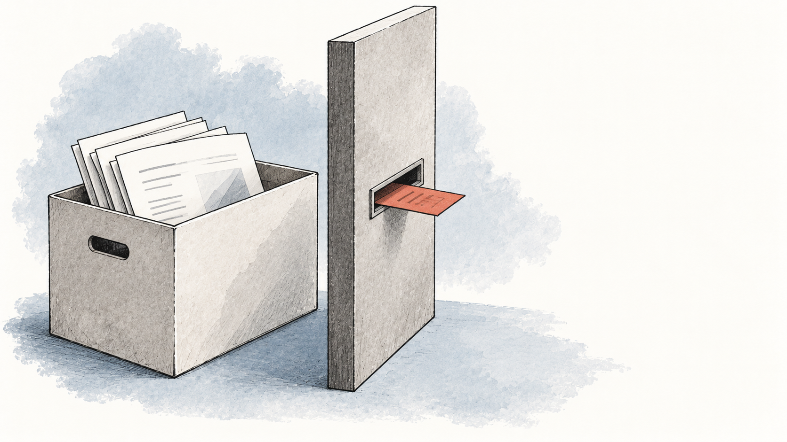

周报工具快做完时，很容易顺手加上云端保存、AI 总结、邮件发送和用户回放。每项看起来都能提升体验，但它们也会让同一份客户表格流向更多地方。等隐私政策开始写“我们可能与服务提供商共享数据”，你可能已经说不清到底共享了什么。

我建议首版先做一次删减：**报告在用户浏览器里生成，不上传原始文件，不接 AI，不保存云端历史；账号、支付和必要的运行记录单独处理。** 这是本章周报工具的设计选择，不是所有 SaaS 的统一答案。若客户的核心需求就是多人共同编辑，放弃协作会让产品失去价值，那就应该承担云端数据处理的工作，而不是硬套“本地更好”。

*先决定完成任务需要传出什么，再决定用哪些服务。*

本章承接[快速入门](/go-global)的周报工具，并沿用商业化章节的教学报价：20 美元购买 30 天使用权且不自动续费。示例面向使用英语的小型网站设计工作室，具体国家与真实需求仍待研究；下文的欧盟、法国等地域例子只在对应条件下使用。数据配置与文案是设计样例；删除恢复演示只操作本页的合成记录，尚未验证真实产品或供应商配置；法规与公开文章核验至 **2026-10-09**。读完应得到一份能交给开发、供应商和专业人员共同核对的处理记录，而非一张“合规完成”证明。

## 把隐私变成产品取舍，而不只是政策措辞

Ink & Switch 的《Local-first software》基于研究原型讨论了一个有价值的取舍：把数据控制更多交给用户，可以减少集中持有数据，但同步、多人协作和备份仍要解决；数据控制权也伴随保管责任。它没有说“把文件留在电脑里就自动合规”。[^src-ink-local-first]

对这个周报工具，我们只借用其中有限的一步：原始表格可以在浏览器里计算，就先不把它变成服务器上的长期资产。代价也写进产品说明：不支持跨设备续写，用户需要自行保存导出的报告；关闭页面后，未导出的结果可能丢失。提供关闭前提示和清楚的导出入口，比悄悄替用户建一个云端档案更符合这个版本的承诺。

分析工具也有类似取舍。Plausible 公开说明，它不提供会话回放和个人跨会话历史，这是刻意放弃的能力；它还提醒使用者不要通过 URL 或自定义事件发送个人资料。这是厂商对自己产品的说明，有商业立场，但其中的约束值得借鉴：少追踪，意味着某些问题要改用汇总数据或用户访谈来回答。[^src-plausible-boundaries]

因此，本例首版不安装会话回放，不在报告页放广告像素。想知道“导出失败了多少次”，先记录错误类型和次数；想知道“客户为什么不满意”，让客户自愿提供脱敏样本。不要为了回答一个很小的问题，先录下所有人在页面上的所有操作。

这也符合数据最小必要的方向：中国个人信息保护法第六条要求目的明确、合理并限于最小必要；GDPR 官方指南同时强调必要性、合法依据以及从设计阶段考虑保护。具体处理依据仍要逐项判断，不能一律写成“用户点过同意”。[^src-cn-pipl][^src-eu-gdpr-business]

## 第一轮：接触真实数据前，把边界画出来

下面是示例首版的目标边界。即使报告文件不上传，账号、账单和访问日志仍可能包含个人信息，不能宣传“我们不处理任何个人数据”。

<figure class="privacy-media" aria-labelledby="privacy-boundary-title">
  <h3 id="privacy-boundary-title">报告内容与账号、购买信息走不同的路</h3>
  
<strong>文件留在浏览器中</strong><ol class="privacy-path"><li>选择 CSV</li><li>页面内汇总</li><li>导出到用户设备</li></ol>
不上传内容，不保存云端历史；关闭页面前要导出。

  

    
<strong>登录路径</strong><ol class="privacy-path"><li>邮箱与账号信息</li><li>账号服务</li><li>登录与服务通知</li></ol>

    
<strong>购买路径</strong><ol class="privacy-path"><li>结账所需信息</li><li>Creem 支付处理</li><li>付款事件回传账号服务 验签后开通权益</li></ol>

  

  <figcaption>这是设计示意。原始表格不进入账号和购买路径；主机、邮件、日志和支付服务的实际名称、处理地区及合同仍须填入记录，每条数据路径都要有实现检查。</figcaption>
</figure>

我会把首版的数据决定写到下面这个粒度。**期限是示例设计目标，不是法定统一期限，也不是已验证的供应商能力。**

| 数据与目的 | 首版决定 | 怎样证明承诺落地 |
|---|---|---|
| CSV 内容与生成的报告 | 仅在页面内处理；不持久化到浏览器存储、不上传、不进入日志 | 用合成文件检查网络请求、浏览器存储和错误上报，导出后重新打开页面不应自动恢复内容 |
| 登录邮箱与账号 ID | 用于登录、找回及必要通知；不默认订阅营销邮件 | 检查登录流程、邮件模板与数据库字段；删除账号时覆盖账号库和邮件服务中的相关记录 |
| 订单 ID、金额、付款和退款状态 | 用于权益、对账和处理争议；不接收完整银行卡号 | 对照实际 webhook 字段，只落库所需字段；账务留存另按适用依据确定，不能随账号删除一概清空 |
| 错误与访问记录 | 自建错误日志只存请求 ID、错误码和版本，拟保留 7 天；不写文件内容、邮箱、令牌或完整查询参数 | 主机/CDN 的 IP 与访问日志另查默认设置和保留期，不能只检查自己写的日志代码 |
| 客服附件 | 默认请用户提供合成或脱敏样本；本例设定工单结束后 7 天内删除临时附件 | 检查工单系统、邮箱附件、开发者下载副本及备份，不把“关闭工单”当作“附件已删” |

这里刻意没有填一个统一的“全部数据保留 30 天”。报告内容、登录信息和账务记录用途不同，适用期限也可能不同。中国法第十九条要求必要的最短时间，第四十七条规定删除情形及依法保留等边界；GDPR 的删除权同样存在法定义务、法律请求等例外。需要保留的，应列明字段、依据、期限和访问范围，不能拿“法律要求”保留整份客户文件。[^src-cn-pipl][^src-eu-gdpr-business]

### 真正检查一次“文件没有上传”

用合成 CSV 加入一段明显的测试文本，例如 `DEMO-NOT-A-CUSTOMER-731`。打开浏览器网络面板，完成导入、生成、导出和一次故意失败的操作，检查请求正文、URL、错误上报以及存储中是否出现这段文本。它不是万能检测，但能暴露最直接的内容外发；还要检查第三方脚本和服务端日志。

如果错误监控上传了整份请求正文，先停止这条采集，修正配置并检查已经留下的记录，同时评估是否触发报告与告知义务。只改隐私政策中的一句话，不能消除已经多收的数据。

上线前的产物应是：一张数据流图、一份字段与期限决定、一份实际请求/存储检查记录。没有运行产品时，只能把它们称为设计和待执行验收。

## 第二轮：让隐私说明与删除路径说同一件事

以下是可以拿去对照实现的**文案片段**，只覆盖报告文件，不是一份可直接发布的完整隐私政策：

> **Your report files**\
> The CSV files you select and the reports generated from them are processed in your browser. We do not upload their contents to our servers or send them to an AI provider. This version does not save your report history. Please export your report before closing the page.\
> Account, payment and support records are handled separately. Please do not send confidential client files when contacting support; use a redacted or synthetic example instead.

完整页面还要写真实经营者与联系方式、各类处理目的和依据、接收者、跨境安排、保存期限，以及用户行使权利的途径。中国法第十七条和 GDPR 官方透明度指南都有对应要求。把每段文字连接到一个内部证据，例如数据库字段、供应商合同、日志配置或删除结果；“我们重视隐私”不能代替这些内容。[^src-cn-pipl][^src-eu-gdpr-business]

删除流程也需要一个具体对象。另设一个**未购买的合成试用账号 `DEMO-DELETE-001`**：有一条邮箱账号、一份会话记录，客服收过一份合成附件；旧备份中也有这三份记录。报告正文仍未上传，这次没有订单需要判断账务留存。

先在当前数据中删除它，再故意从旧备份恢复。页面会显示，旧资料怎样重新出现。现实中应在隔离环境恢复，重新执行尚需适用的删除记录、核对结果后，才恢复对外服务。

<section class="privacy-media" data-privacy-deletion aria-labelledby="privacy-deletion-title">
  <h3 id="privacy-deletion-title">账号删过一次，恢复后还在吗？</h3>
  
固定合成记录，只在本页内存运行；不读取你的账号、文件或浏览器存储。删除记录与旧备份分开保存。

  

    <dl class="privacy-records">
<dt>当前账号邮箱</dt><dd data-privacy-account>demo@example.invalid</dd>

<dt>当前会话</dt><dd data-privacy-session>1 个合成会话</dd>

<dt>当前客服附件</dt><dd data-privacy-attachment>synthetic.csv</dd>

<dt>删除记录</dt><dd data-privacy-record>尚未记录</dd>
</dl>
    
尚未删除。当前三类合成记录都有一份副本，旧备份也保留了这组记录。

  

  
<button type="button" data-privacy-remove>模拟删除当前资料</button><button type="button" data-privacy-restore disabled>模拟遗漏删除记录的恢复</button><button type="button" data-privacy-reapply disabled>重新应用删除记录</button><button type="button" data-privacy-reset>重置示例</button>

  <noscript>
未启用脚本：首次删除后，账号、会话与附件都移除；直接恢复旧备份会把三者带回；重新应用删除记录后，三者再次移除。旧备份本身仍需按实际策略清理。
</noscript>
</section>

  
<strong>这次教学记录的结果：</strong>首次删除确实清掉了当前三类资料；遗漏删除记录的恢复又带回了它们。修正后的流程把删除记录应用到恢复副本，确认该账号、会话和附件均查不到，再允许恢复后的服务上线。

  
<strong>还不能承诺的事：</strong>这没有证明旧备份本身已经清除，也没有连接邮件或客服供应商执行删除。真实回复须分别列出已删除、受限保留和待清理的项目、依据与时间，不能只写“全部删除成功”。

备份清理需要实际可执行的期限，删除记录本身也要限定字段、用途和保留范围。不能把“留着以后可能有用”作为无限保存的理由。中国法第四十七条对依法保留或技术上难以删除的情况还要求停止除存储和必要安全保护之外的处理；恢复旧副本后重新用于服务，并不能用“这是备份”来解释。[^src-cn-pipl]

真实请求应通过现有账号或适当方式核对归属，不默认要求身份证照片；邮件、客服及开发者另存的副本都要纳入处理。若账号仍有付费权益，先说明删除会怎样影响使用，退款或撤回请求单独处理，不能把放弃法定权利设为删除条件。必要账务记录要逐项核定依据、字段、期限和访问权限，不能跟账号表一起盲目清空；[税务](/go-global/tax)中的底稿说明了这些记录各自证明什么。[^src-cn-pipl][^src-eu-gdpr-business]

在适用 GDPR 时，权利请求原则上应在一个月内回复，复杂或多个请求可按条件延长并告知；中国法则要求建立便捷的受理处理机制，拒绝请求应说明理由。不要把同一个模板时限无条件套在所有地区。[^src-eu-gdpr-business][^src-cn-pipl]

把这个例子换成自己的服务时，先选一个合成账号，在实际接收方、备份和恢复流程中走完。页面演示通过不等于供应商已删除；真实资料开放之前，需要的是这份实际检查记录。

## 第三轮：按业务变化补上条件性工作

这些事情不必全部在一个晚上堆进首版，但**一旦相关条件已经存在，就要在对应处理或销售发生前解决**，不能以“小产品”为理由跳过。

### 数据进入海外服务，或从海外回到境内

本例即使不上传报告，也可能使用海外主机、登录邮件和支付服务。先列实际字段、接收者、处理/备份地区、是否再委托、删除能力与合同角色，再判断需要什么安排。GDPR 对控制者、处理者合同和欧盟外传输有要求；中国法第二十一条也规定委托处理的约定及监督义务。支付方、主机和邮件商的角色应分别确定，不能全部填成同一种“第三方”。[^src-eu-gdpr-business][^src-cn-pipl]

中国《促进和规范数据跨境流动规定》对特定境外来源数据回传、履约和数量条件设有机制豁免；2026 年小型处理者规定也有相关安排。豁免安全评估、标准合同或认证这类机制，不等于全部告知、同意和评估义务同时消失。要把“处理了谁的数据、在哪里进入系统、是否混入其他数据”说清楚，才有条件判断。[^src-cn-cross-border-data][^src-cn-small-data-processors]

需要外部核对时，可以给出这样一份具体问题说明：

> 示例经营者位于中国大陆；拟向英语小团队提供周报工具。报告内容只在用户浏览器处理；账号邮箱、订单和服务通知由所选海外服务处理，经营者可能从境内访问后台。请根据附件所列的服务商、处理地区、数据类别、人数和合同，判断各方角色、适用的跨境路径，以及应完成的告知、同意、合同和评估。哪些项必须在首个真实账号创建前完成？

实际发送前补全服务商和合同。只问“服务器放海外是不是就没问题”，无法得到同样有用的答复。

### 面向欧盟用户，或开始用户级追踪

GDPR 的地域判断包括欧盟内设立，以及欧盟外经营者向欧盟境内个人提供服务或监测其行为等情形；小团队客户中的联系人也可能是可识别的自然人。因此，“卖给企业”与“完全不处理个人信息”不能画等号。中国境内进行的个人信息处理，也不能仅凭客户在海外就排除中国法。[^src-eu-gdpr-business][^src-cn-pipl]

Cookie 应按实际用途判断。欧盟官方指南区分严格必要的用途和需要事先同意的追踪用途；后者应在同意后才设置，撤回也应方便。首版不做可选追踪，可以少做一条同意流程，但登录、第三方结账及嵌入组件仍要逐项检查。不能仅因为某分析产品叫“无 Cookie”，就认定整站无需处理隐私问题。[^src-eu-cookies][^src-plausible-boundaries]

若以后加回放或广告像素，重新用独立会话检查“未选择、拒绝、部分同意、撤回”四种状态，而不是只看横幅能否关闭。拒绝后仍然外发的脚本，需要修实现。

### 向消费者销售，或开始自动续费

示例不自动续费，只减少了周期扣款的复杂度，并没有消除退款或法定撤回问题。欧盟远程消费者合同通常有 14 天撤回期；数字内容和已完全履行服务的例外有条件，不能把所有 SaaS 都写成“数字商品一经售出不退”。[^src-eu-withdrawal]

2026 年的在线撤回功能也要纳入销售设计。欧盟委员会说明 2023/2673 修订自 2026 年 6 月 19 日起适用；本轮进一步核对了法国官方在 10 月 2 日更新的实施指南。以下是**法国市场、适用撤回权时的流程示例**，不能直接当作所有成员国的完整实现：[^src-eu-consumer-rights-directive][^src-fr-online-withdrawal]

1. 购买前告知撤回功能的位置；在撤回期间保持入口清楚、可见且可访问。
2. 用户选择相关合同，填写或确认姓名、合同识别信息及接收回执的方式。
3. 用明确的确认操作提交撤回声明，避免和“取消下次续费”混用。
4. 在合理时间内以邮件等持久载体发送回执，包含声明内容、提交日期和时间；再按适用规则处理退款及服务状态。[^src-fr-online-withdrawal]

对 `demo-001`，一份撤回回执应让用户看见“撤回的是这份合同、我们何时收到声明、接下来怎样处理”，不能只回复“自动续费已关闭”。使用 MoR 时，把谁提供入口、谁发回执、谁退款及谁撤销权益与平台确认，并实际联调；其他目标市场的适用条件和实施规则仍须分别核对。

### 增加 AI、敏感数据或新的用户群

新功能先改数据图：发给模型的是哪些列，供应商是否保留或再使用，用户是否有权提供这些内容，原先的告知与处理依据是否仍成立。不要把“不用于训练”当作“不发生传输”。涉及敏感个人信息、未成年人或高风险处理时，先核对专门要求；中国法和 GDPR 都有相应规定，不能沿用普通周报样例直接上线。[^src-cn-pipl][^src-eu-gdpr-business]

## 业务变大后，复查假设；出事时，按记录行动

截至本页核验日，中国的小型个人信息处理者规定已于 2026 年 9 月 1 日施行，处理不满 10 万人个人信息的处理者可按条件使用简化措施。其中依托平台免另行制定规则的安排有多项前提，自己建站并处理账号资料不能只因为用了支付平台就直接套用。人数、数据类别、供应商或经营方式变了，应重新核对原来的简化或豁免判断。[^src-cn-small-data-processors]

发生泄露或误传时，数据记录会帮你回答“哪些字段、哪些人、去了哪里”。限制继续外发与访问、保全必要记录并采取补救的同时，就开始判断报告与告知义务。中国个人信息通知、较大以上网络安全事件报告和 GDPR 通知各有触发条件及路径，不能把一个统一倒计时复制到所有事件；具体时限和未查清时怎样先报，见[风控与账户安全](/go-global/risk#数据事件采用独立的响应流程)。[^src-cn-pipl][^src-cn-cyber-incident-report][^src-eurlex-gdpr-breach]

本章的完成物应当能够彼此核对：数据图上的每个接收者都出现在记录中；政策里每个承诺都有配置或操作支持；用户的退出、退款和删除请求各有路径。若你今天只能先完成一件事，就从合成 CSV 开始，查清它在一次完整使用中到底去了哪里。
